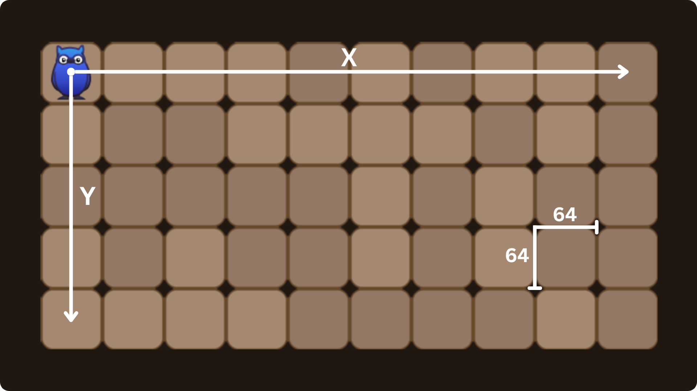
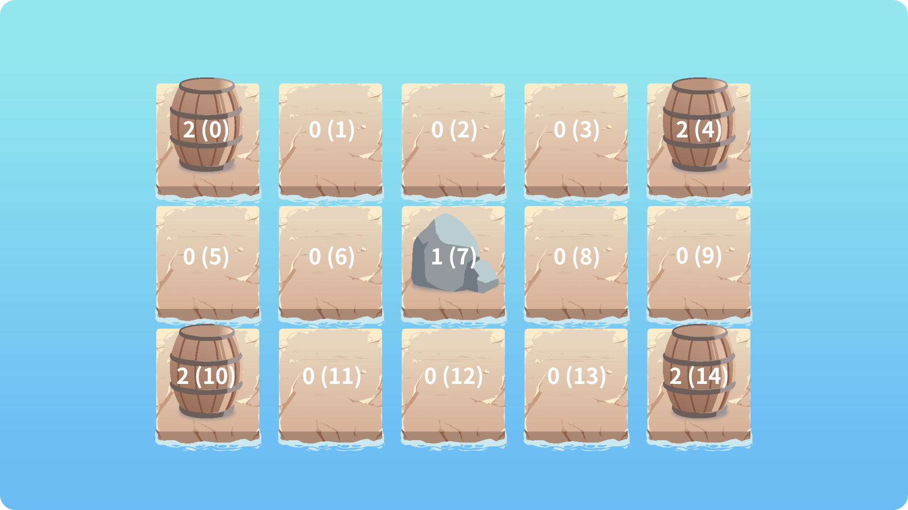
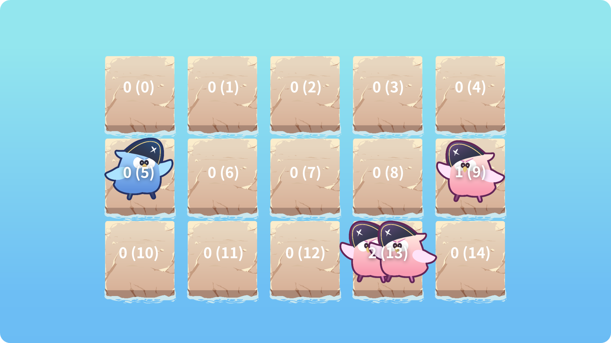

# 💣 炸彈人

## 玩法介紹

玩家需要想辦法使用炸彈攻擊其他玩家，在限定時間內獲得盡可能多的分數。炸彈不會攻擊同團隊的其他玩家，並且當多個炸彈在彼此的 `爆炸範圍` 內爆炸就會產生 `連鎖爆炸`！地圖上的 `障礙物` 會阻擋玩家的移動，玩家可以透過炸彈來破壞 `可破壞的障礙物` 以讓自己更好移動。

<details>
  <summary>🕹️ 手動操作</summary>

  > * 移動: `w` `s` `a` `d`
  > * 放置炸彈: `z`
</details>

<details>
  <summary>📊 計分機制</summary>

  > * 炸到敵隊玩家: `+2`
  > * 被敵隊玩家炸到: `-1`
</details>

# 遊戲設定

你可以透過設定 `遊戲參數` 與 `關卡參數` 來自定義你的對局，可自訂的範圍從 `玩家數量`、`遊戲時長` 到 `玩家炸彈數量`、`炸彈爆炸範圍` 甚至是製作全新的關卡！

* [關卡編輯教學](./documents/editor.md)

## 遊戲參數

```py
Game(level_name: str, level_path: Union[None, str], window_width: int = 1480, window_height: int = 740, user_num: int = 1, team_mode: str = "off", game_duration: int = 10)
```

- `level_name: str` [內建關卡](./documents/editor)的名稱。
- `level_path: str` 關卡檔案的路徑 (設定此參數會覆蓋掉 `level_name`)。
- `window_width: int` 遊戲視窗寬度。
- `window_height: int` 遊戲視窗的高度。
- `user_num: int` 玩家的數量。
  - 範圍為: `1 ~ 4`。
- `team_mode: str` 關卡模式 (`on` 或 `off`)。
  - 預設為: `off`。
- `game_duration: int` 遊戲時長 (幀數)。

## 關卡參數

我們使用 JSON 作為關卡的資料格式 (以下的範例與 [Tiled](https://mapeditor.org) 的格式不同，但兩種格式都是支援的)，你可以使用我們提供的[炸彈人關卡編輯器](https://lmantw.github.io/bomb-editor)或 [Tiled](https://mapeditor.org) 來編輯關卡。

```py
{
  "rules": {
    "player_speed": int,
    "player_bombs": int,

    "bomb_countdown": int,
    "bomb_explosion_range": int
  },

  "map": {
    "width": int,
    "height": int,

    "tiles": list
  }
}
```

- `rules: dict` 關卡的規則。
  - `player_speed: int` 玩家的移動速度。
  - `player_bombs: int` 玩家的炸彈數量。
  - `bomb_countdown: int` 炸彈的倒數時長 (幀數)。
  - `bomb_explode_range: int` 炸彈的爆炸範圍。
- `map: dict` 關卡的地圖。
  - `width: int` | 關卡的寬度 (瓦磚數)。
  - `height: int` | 關卡的高度 (瓦磚數)。
  - `tiles: list` | 地圖上的瓦磚。

# 遊戲資料

```py
{
    "status": str,
    "frame": int,

    "score": int,
    "bomb_amount": int,
    "bomb_cooldown": int,

    "width": int,
    "height": int,
    "x": int,
    "y": int,

    "tile_matrix": list,
    "enemy_matrix": list,
    "bomb_matrix": list
}
```

- `status: str` 遊戲的狀態 (`GAME_ALIVE`、`GAME_PASS` 或 `GAME_OVER`)。
- `frame: int` 遊戲當前的幀數。
- `score: int` 玩家的分數。
- `bomb_amount: int` 玩家剩餘的炸彈數。
- `bomb_cooldown: int` 玩家放置炸彈的冷卻時間 (幀數)。
- `width: int` 地圖的寬度 (瓦磚數)。
- `height: int` 地圖的高度 (瓦磚數)。
- `x: int` 玩家的 X 座標。
- `y: int` 玩家的 Y 座標。
- `tile_matrix` 瓦磚的矩陣資料。
- `enemy_matrix` 敵隊玩家的矩陣資料。
- `bomb_matrix` 敵隊炸彈的矩陣資料。

## 座標系統



## 瓦磚矩陣資料

* 大小: `地圖寬度` * `地圖高度`。
* 數值: `0 (無)`、`1 (不可破壞)` 或 `2 (可破壞)`。



## 敵隊玩家矩陣資料

* 大小: `地圖寬度` * `地圖高度`。
* 數值: 在該位置上的敵隊玩家數。



## 敵隊炸彈矩陣資料

* 大小: `地圖寬度` * `地圖高度`。
* 數值: 在該位置上的敵隊炸彈數。

(與[敵隊玩家矩陣資料](#敵隊玩家矩陣資料)類似)
