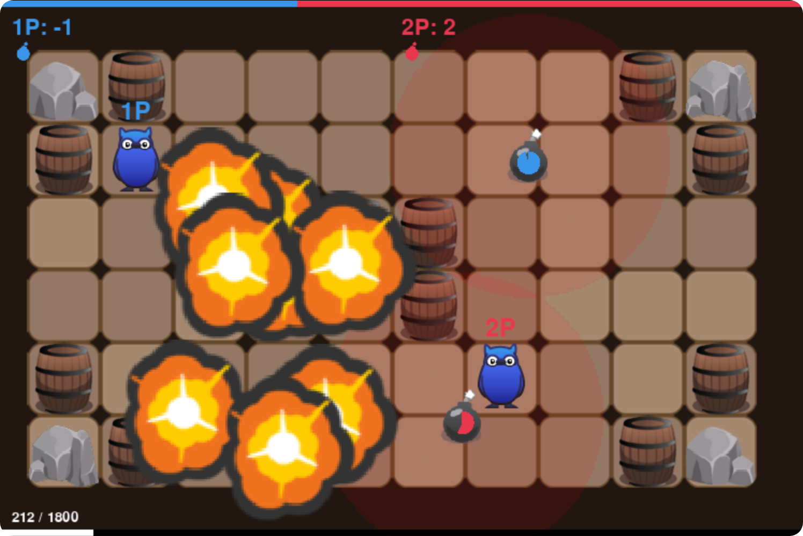
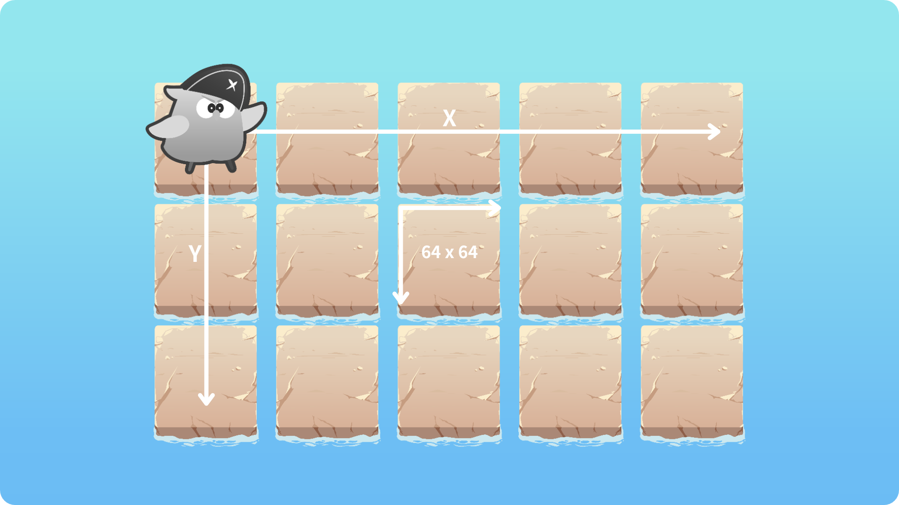
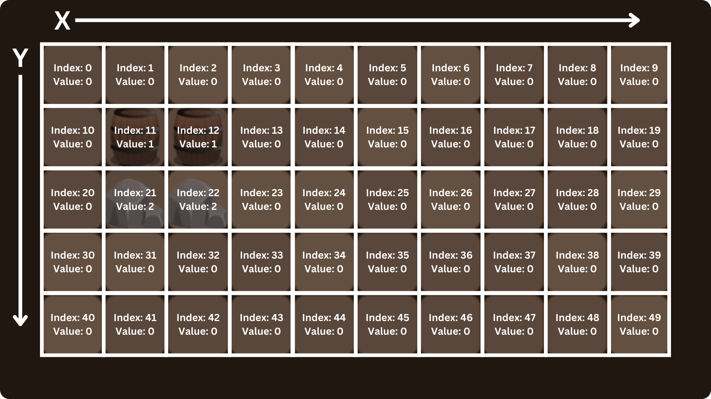
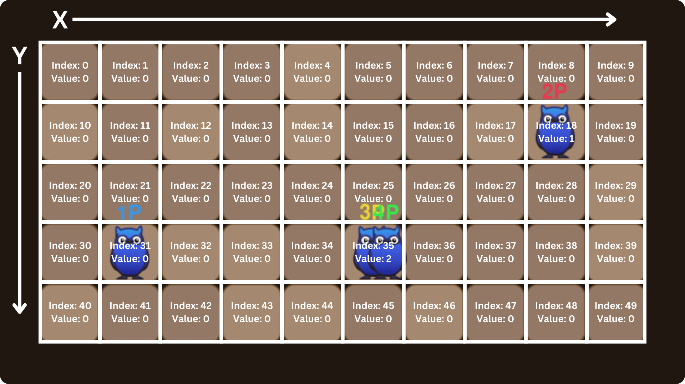

# 💣 炸彈人
爆炸吧！訓練你的 AI 來控制角色的移動，放置與躲避炸彈，成為最會炸的炸彈人吧！



## 玩法介紹
玩家需要在特定的時間內使用炸彈攻擊敵對玩家，獲得境可能多的分數。炸彈不會影響友方團隊的其他玩家，且當多個炸彈在彼此的爆炸範圍內就會產生 `連鎖爆炸`。另外地圖上的 `瓦磚 (Tile)` 會阻擋玩家的移動，玩家可以破壞地圖上 `可破壞的瓦磚` 來讓自己更好移動。

> 手動操作：
> * `w` `s` `a` `d` 移動角色。 
> * `z` 放置炸彈。

## 計分機制
* `炸到敵對玩家` + 2
* `被炸到` - 1

# 遊戲設定
你可以簡單的設置遊戲的參數，另外我們也提供了一個人類可讀的關卡檔案格式 (與編輯器)，讓你可以輕鬆的打照你心中的完美關卡！

## 遊戲參數
```py
Game(level_name: str, level_file: Union[None, str], width: int = 750, height: int = 500, user_num: int = 1, game_duration: int = 1800, team_mode: str = "off")
```
* `level_name: str` 關卡名稱 (遊戲預設的關卡名稱)。
* `level_file: str` 關卡檔案路徑，設置此參數會覆蓋掉 "level_name"。
* `width: int` 視窗的寬度。 
* `height: int` 視窗的高度。
* `user_num: int` 玩家的數量。
  * 範圍為 1 ~ 關卡支援的最大玩家數 (最大為 4)。
* `game_duration: int` 遊戲的時長 (幀數)。
* `team_mode: bool` 團隊模式。
  * 只在玩家數量為 2 個以上時才有用，在 3 個玩家時會有一對只有一個玩家。

## 關卡參數
我們使用 JSON 來作為關卡的檔案格式，你可以用我們的[關卡編輯器](https://lmantw.github.io/bomb-editor/)來編輯關卡或手動更改關卡檔案，以下為一個簡單的範例：
```json
{
  "rules": {
    "player_speed": 5,
    "player_bombs": 2,

    "bomb_countdown": 150,
    "bomb_explode_range": 125
  },

  "map": {
    "width": 10,
    "height": 5,

    "tiles": [{ "type": "barrel", "x": 1, "y": 1 }, { "type": "player", "x": 0, "y": 0 }]
  }
}
```
* `Rules` 關卡規則。
  * `player_speed: number` 玩家的移動速度。
  * `player_bombs: number` 玩家的炸彈數。
  * `bomb_countdown: number` 炸彈的爆炸倒數時長 (幀數)。
  * `bomb_explode_range: number` 炸彈的爆炸範圍。
* `Map` 關卡的地圖
  * `width: number` 關卡的寬度 (幾個瓦磚)。
  * `height: number` 關卡的高度 (幾個瓦磚)。
  * `tiles: list` | 地圖上的瓦磚。
  * `spawns: list` | 玩家的重生點，清單的長度決定了最大的玩家數量。

# 遊戲資料
遊戲提供給玩家一些如地圖瓦磚資訊、玩家位置、炸彈位置等資料，你可以用這些資料來訓練你的 AI。
* `status: str` 遊戲的狀態。
  * 可為：`GAME_ALIVE` `GAME_PASS` `GAME_OVER`。
* `frame: int` 當前幀數。
* `team: int` 玩家所屬團隊。
* `score: int` 玩家的分數
* `bombs: int` 玩家剩餘炸彈數。
* `x: int` 玩家的 X 座標。
* `y: int` 玩家的 Y 座標。
* `tiles_matrix: list` 瓦磚的矩陣資料。
* `players_matrix: list` 敵對玩家的矩陣資料。
* `bombs_matrix: list` 敵對玩家的炸彈資料。

## 座標系統
遊戲內有兩種座標系統，`實際座標` 與 `顯示座標`。`實際座標` 為遊戲世界中實際的座標，`顯示座標` 則為顯示到螢幕上的座標，在這裡我們指的的座標都為 `實際座標`。


## 瓦磚矩陣資料
瓦磚的矩陣資料為一個清單，長度為 `地圖寬度` x `地圖高度`。該清單中可以有三個值，分別為：
* `0` 沒有瓦磚。
* `1` 有可破壞的瓦磚。
* `2` 有不可破壞的瓦磚。


## 玩家矩陣資料
玩家的矩陣資料與[瓦磚矩陣資料](#瓦磚矩陣資料)類似，只是清單中的值由在該位置的敵對玩家數所決定：


## 炸彈矩陣資料
炸彈的矩陣資料與[玩家矩陣資料](#玩家矩陣資料)相同，只是清單中的直由在該位置的敵對玩家炸彈數所決定。
