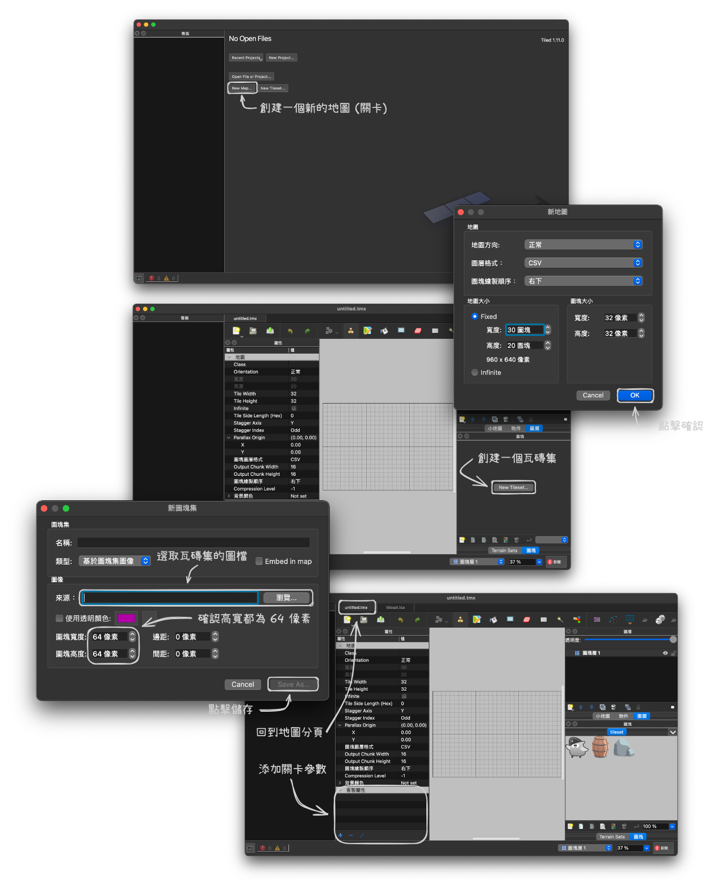

# 🗺️ 關卡編輯器

你可以使用我們提供的[炸彈人關卡編輯器](https://lmantw.github.io/bomb-editor)或 [Tiled](https://mapeditor.org) 來編輯關卡。這裡推薦使用我們提供的關卡編輯器，操作起來會比起 [Tiled](https://mapeditor.org) 簡單且不需要另外下載與安裝。

## 炸彈人關卡編輯器

* [編輯器連結](https://lmantw.github.io/bomb-editor)

## Tiled 編輯器

* [Tiled 官網](https://mapeditor.org)
* [Tiled 下載頁面](https://thorbjorn.itch.io/tiled)

(另外還可參考 [Maze Car](https://github.com/PAIA-Playful-AI-Arena/Maze_Car) 的 [迷宮製作教學](https://github.com/PAIA-Playful-AI-Arena/Maze_Car/blob/main/map_editor.md))
