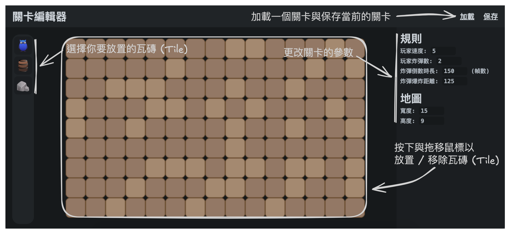
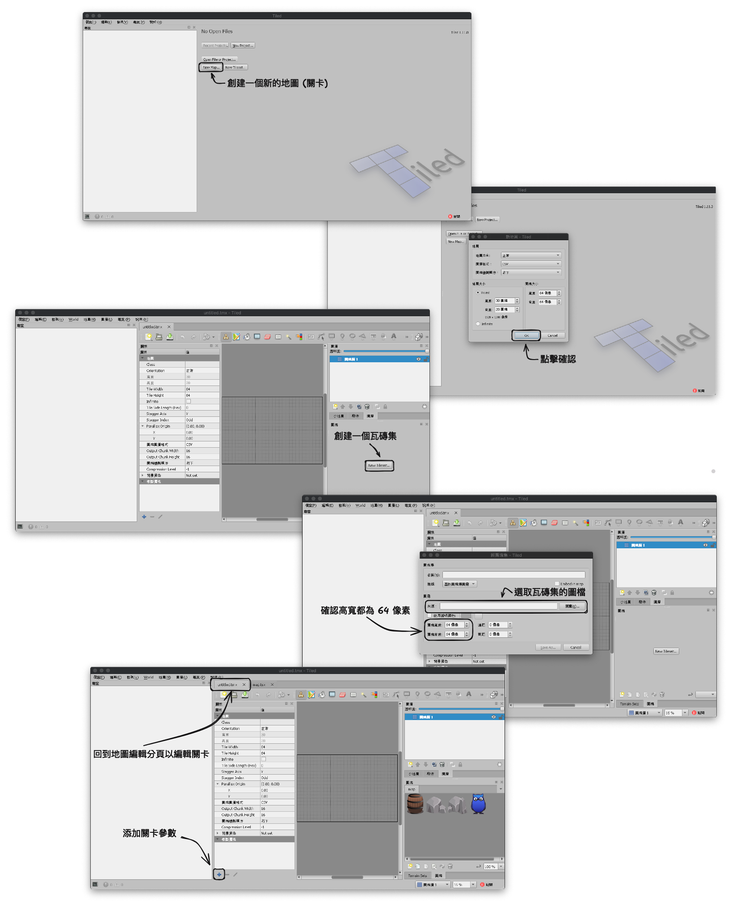

# 🛠 關卡編輯器
我們有自己的關卡編輯器，但你也可以使用 [Tiled](https://www.mapeditor.org) 來編輯關卡。

## 炸彈人關卡編輯器

* 關卡編輯器連結 - https://lmantw.github.io/bomb-editor

## Tiled 編輯器

(另外可參考 [Maze Car](https://github.com/PAIA-Playful-AI-Arena/Maze_Car) 的 [迷宮製作教學](https://github.com/PAIA-Playful-AI-Arena/Maze_Car/blob/main/map_editor.md))

* 瓦塊集

* 關卡參數
  * `player_speed: int` 玩家的移動速度。
  * `player_bombs: int` 玩家的炸彈數。
  * `bomb_countdown: int` 炸彈的爆炸倒數時長 (幀數)。
  * `bomb_explosion_range: int` 炸彈的爆炸範圍。
